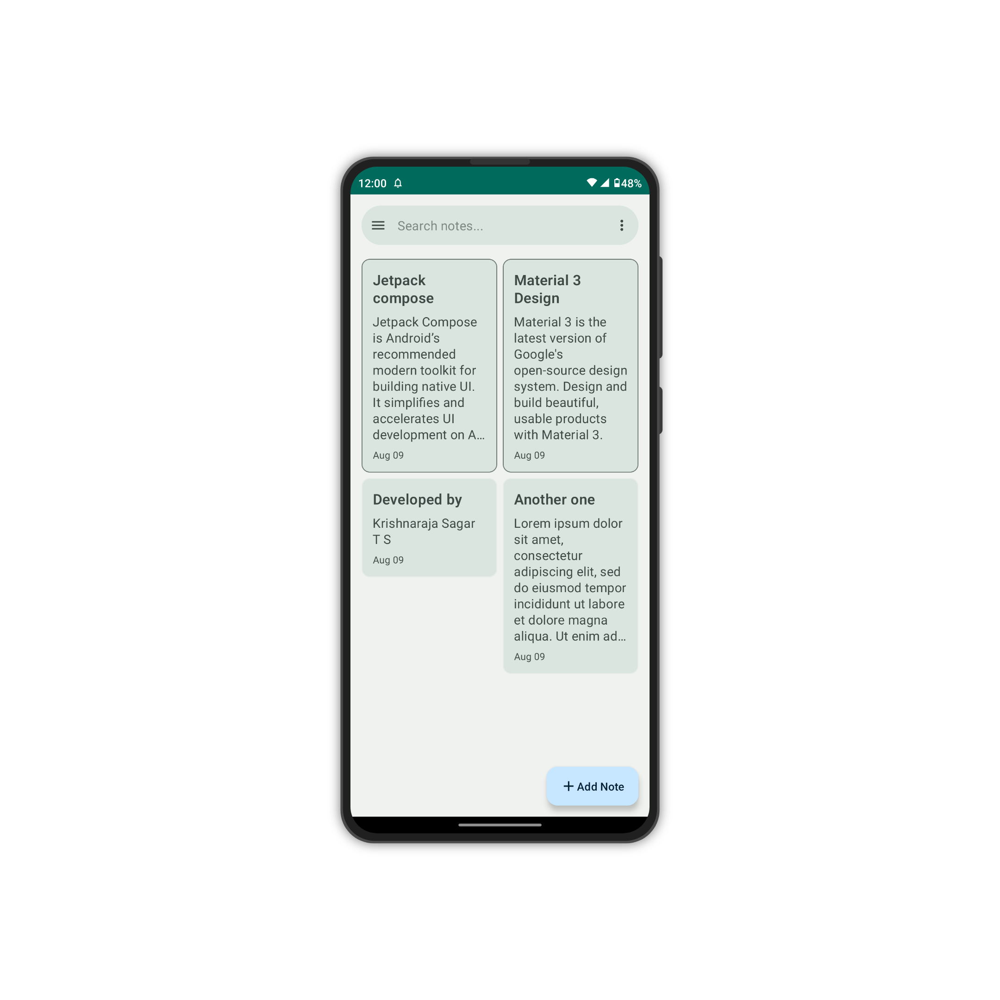
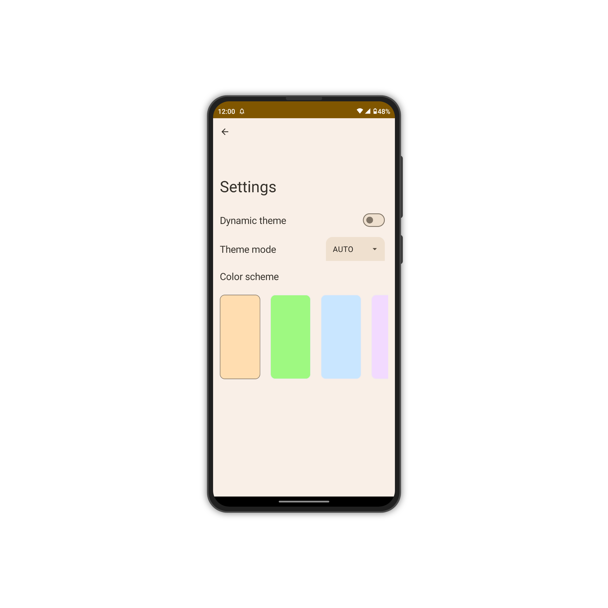

# Material3 Notes
A notes application built using Jetpack Compose, the new declarative framework for native android development.

(Still in development)

Notes Screen                              | Settings                       
:----------------------------------------:|:------------------------------:
  | 

## Features
* CRUD operations
* Data persistence with Room
* Material 3 design
* Search
* Pins
* Settings (Theme mode, Color scheme selection)
* Tags (TODO)
* Markdown support (TODO)
* Sharing and exporting (TODO)
